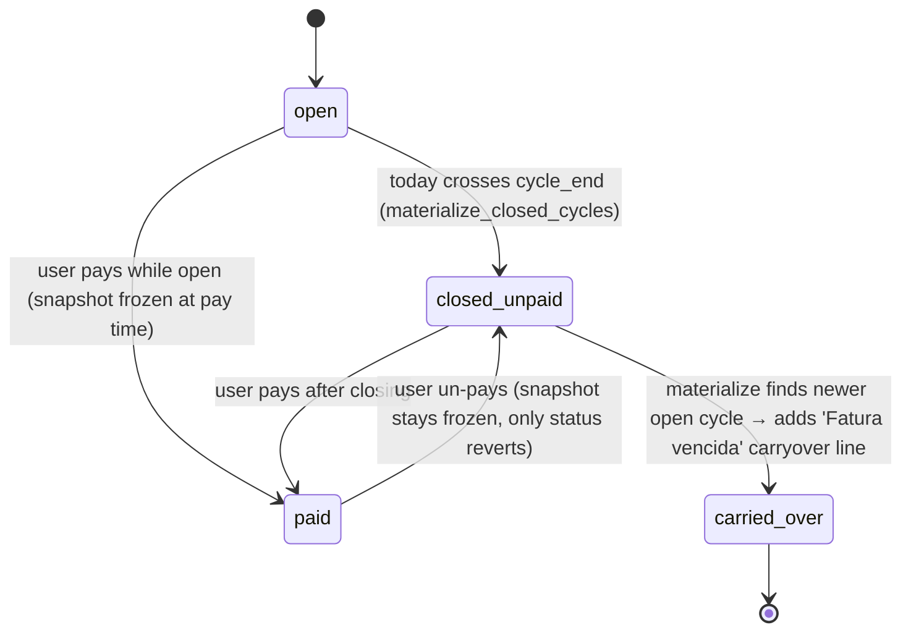

# FatCat Architecture Guide (for Future Agents)

This document explains how the app is composed, how data flows through it, and what each part is responsible for. The app was rewritten from a
month-based ledger to a **cycle-based** one; keep that mental model in mind before editing finance code or filters.

## 1) Stack and runtime model

- Backend: FastAPI (`app/main.py`) + SQLModel/SQLAlchemy (`app/models.py`, `app/db.py`)
- Frontend: Server-rendered Jinja templates (`app/templates/**`) + HTMX partial updates
- Charts/visuals: Chart.js + D3 Sankey (`app/static/js/charts.js`)
- Database: SQLite file at repository root (`fatcat.db`)
- Test style: unit tests for finance rules + integration tests for routes (`tests/`)

The app is primarily multi-page server-rendered HTML with selective in-page updates via HTMX.

## 2) Boot sequence and request lifecycle

### Startup

1. Uvicorn loads `app.main:app`.
2. FastAPI lifespan calls `init_db()` from `app/db.py`.
3. `init_db()`:
   - creates tables from SQLModel metadata,
   - ensures one `AppSettings` row exists.
4. Routers are mounted (`settings`, `categories`, `dashboard`, `cards`, `expenses`, `subscriptions`, `income`).

> Note: there is no migration layer. The cycle-based rewrite starts from a fresh schema; delete any pre-existing `fatcat.db` before the first
> boot on a legacy install. New cycles are materialized lazily on page load, not backfilled from historical transactions.

### Per request

1. Route gets a SQLModel session via dependency `get_session()`.
2. Route resolves the selected **cycle-end** month/year with `resolve_and_sync_period()` from `app/routes/common.py`.
3. `resolve_and_sync_period()` also calls `materialize_closed_cycles(session, today)` so the `BillCycle`/`BillCycleLine` persistence
   self-heals every time a page is viewed.
4. Route queries domain tables and applies finance rules from `app/services/finance.py` or persistence helpers from
   `app/services/bills.py`.
5. Route renders:
   - full page (`pages/*.html`) for normal navigation,
   - partial (`partials/*.html`) for HTMX actions.

## 3) Repository map and responsibilities

### Core app wiring

- `app/main.py`: FastAPI app creation, static mount, router registration, `/` redirect, legacy `/pix` redirect.
- `app/db.py`: engine config, foreign-key PRAGMA, database bootstrap, session dependency.
- `app/models.py`: all SQLModel tables and constraints (including `BillCycle`, `BillCycleLine`, and `AppSettings.pix_closing_day`).
- `app/seed.py`: local seed script for demo/test dataset.

### Shared domain logic

- `app/services/finance.py`: pure business rules:
  - cycle math (`cycle_end_for_purchase`, `cycle_bounds`, `active_cycle_today`, `cycle_vencimento`),
  - membership checks (`subscription_cycle_hit`, `pix_cycle_hit`),
  - line generation (`lines_for_open_cycle`, `lines_for_open_pix_cycle`, `expenses_for_cycle`),
  - activity windows for income/subscriptions (`is_income_active`, `is_subscription_active`, `pix_for_month`),
  - totals and urgency (`card_total`, `outstanding_for_card`, `due_urgency`).
- `app/services/bills.py`: **persistence** of the bill lifecycle:
  - `materialize_closed_cycles(session, today)` reconciles every card (and the synthetic PIX flow) against the calendar; cycles that have
    crossed their end day are promoted to `closed_unpaid` with a frozen line snapshot, while the active cycle gets an `open` row whose
    only persisted content is the optional `carryover` line.
  - `pay_bill` / `unpay_bill` freeze the line snapshot (for opens) or toggle status back and forth.
  - `open_bill_live_total` / `lines_for_bill` read a bill's content; open cycles mix live-computed lines with persisted carryovers, while
    closed and paid cycles read exclusively from `BillCycleLine`.

### Route layer

- `app/routes/common.py`: shared request context, cycle sync, and the `materialize_closed_cycles` hook.
- `app/routes/dashboard.py`: cycle-based metrics and chart payloads, consuming `BillCycle`/`BillCycleLine` for closed bills and
  `open_bill_live_total` for the active cycle.
- `app/routes/cards.py`: card CRUD + per-card open/closed/unpaid view, `pay`/`unpay` endpoints, and a bill-history partial.
- `app/routes/expenses.py`: merged ledger view grouped by cycle-end month (expenses + subscriptions + PIX), filters, expense CRUD.
- `app/routes/subscriptions.py`: subscription CRUD; active-per-cycle status uses `subscription_cycle_hit`.
- `app/routes/income.py`: income source CRUD (still calendar-month, incomes are not cycle-bound).
- `app/routes/categories.py`: category CRUD, inline quick-create, "Outros" fallback on delete.
- `app/routes/settings.py`: month navigation, theme toggle, and the `POST /settings/pix-cycle` endpoint that sets `pix_closing_day`.

### Rendering layer

- `app/templates/base.html`: app shell, sidebar (cycle month selector), PIX closing-day control, theme switch, static includes.
- `app/templates/pages/*.html`: full-page views.
- `app/templates/partials/*.html`: HTMX targets for table/form refreshes. Key cycle-era partials:
  - `partials/cards_table.html` renders each card with its active cycle and any closed unpaid bills alongside a pay button.
  - `partials/pay_button.html` is the pay/unpay control + alarm pill.
  - `partials/bill_history.html` is the expandable bill history per card.
- `app/templates.py`: Jinja environment + BRL currency formatter.

### Client-side scripts

- `app/static/js/ui.js`: UI behavior for dynamic forms; re-initializes after HTMX swaps.
- `app/static/js/charts.js`: reads JSON payloads embedded in dashboard template and renders charts.
- `app/static/css/styles.css`: global styles plus cycle UI (`cards-grid`, `bill-row`, `alarm-pill`, `pay-wrap`, `bill-history`).

### Quality gates

- `tests/test_finance.py`: pure rule tests for cycle math, installment membership, activity windows.
- `tests/test_bills.py`: bill-cycle persistence (materialization, pay/unpay, carryover propagation, PIX cycles).
- `tests/test_routes.py`: end-to-end route behavior, filter/navigation regressions, pay/unpay endpoint.

## 4) Data model and ownership

Main entities in `app/models.py`:

- `AppSettings`: singleton row for theme + selected cycle (`selected_month`/`selected_year` now represent the **cycle-end month**) +
  `pix_closing_day` (0 means PIX follows calendar month; 1–31 enables real PIX cycles).
- `IncomeSource`: recurring or one-off income streams, optional end date. Incomes stay calendar-month; they are never re-anchored by cycles.
- `Category`: normalized category dictionary.
- `Card`: card metadata + maintenance fee policy.
- `Expense`: card-linked debit/credit purchases, optional installments.
- `Subscription`: recurring/finite charges, payment method `card` or `pix`.
- `PixItem`: one-off or recurring PIX entries (no card, no charge day).
- `BillCycle` (NEW): persistent statement per `(scope, card_id, cycle_end_month, cycle_end_year)`. `scope` is `card` or `pix`; `status`
  is `open` / `closed_unpaid` / `paid`. `total_amount` is frozen when status leaves `open`. `carryover_from_id` can trace overdue
  cascading (currently informational).
- `BillCycleLine` (NEW): frozen snapshot of a single line inside a non-open cycle, or a persisted `carryover` line on an open cycle.
- `SavingsGroup` / `SavingsEntry`: future-facing entities, not wired to UI yet.

Notable integrity rules:

- `Expense.card_id` is always required (both debit and credit).
- `Subscription.payment_method='card'` requires `card_id`; `pix` does not.
- `BillCycle` has `(scope, card_id, cycle_end_month, cycle_end_year)` unique; PIX bills always have `card_id IS NULL`.
- `BillCycleLine.kind` must be one of `expense`, `debit`, `subscription`, `maintenance`, `carryover`, `pix`.
- Numeric/date-like bounds (month 0..11, day ranges, positive amounts) are enforced via DB constraints.

## 5) Billing cycle model

Key rules:

- A cycle is **labeled by its `cycle_end_month/year`**. The bill ending in May is the "May bill" in graphs, filters and metrics.
- `cycle_end_for_purchase(closing_day, day, month, year)` is the single source of truth for "which cycle does this charge fall into".
  Closing day 0 collapses the cycle to the calendar month. A charge on day `D > effective_closing_day` rolls into the next cycle.
- `active_cycle_today(closing_day, today)` picks the cycle containing today. Used for deciding which cycle is `open` per card.
- `materialize_closed_cycles` guarantees:
  1. Every past cycle with activity has a `closed_unpaid` `BillCycle` with a frozen `BillCycleLine` snapshot (including an inherited
     carryover from the preceding unpaid cycle).
  2. The active cycle always has exactly one `open` `BillCycle`, with live-computed lines and a persisted `carryover` line reflecting
     the preceding cycle's current status (refreshed on every call).
  3. If a previously-`open` cycle has since been overtaken by time, it is promoted to `closed_unpaid` with a snapshot of its live
     contents.
- PIX cycles are only materialized when `AppSettings.pix_closing_day > 0`. Setting it to 0 disables PIX cycles entirely; PIX items and
  PIX subscriptions then stay month-bound in the dashboard metrics.

## 6) Communication between parts

### A) URL/query state -> shared context

- `month` and `year` are propagated in query strings across navigation and HTMX forms, now representing the cycle-end month.
- `resolve_and_sync_period()` keeps `AppSettings` synchronized with query params and triggers `materialize_closed_cycles`.
- `base_context()` injects common template variables (`month_label`, `theme`, serialized `query`, `pix_closing_day`).

### B) Routes -> service layer

Routes should not duplicate finance math. They call `app/services/finance.py` for cycle math / membership and `app/services/bills.py`
for persistence of the bill lifecycle.

### C) Routes -> templates

- Full pages include placeholder wrappers (`#...-form-wrap`, `#...-table-wrap`, `#bill-history-wrap`).
- HTMX endpoints return partial templates to replace those wrappers.
- Pay/unpay actions return the cards table partial so the alarm pill and totals refresh in-place.

### D) Templates/HTMX -> routes

Common patterns:

1. Form open/submit: `hx-get /form -> hx-post /save -> table partial`.
2. Delete: `hx-delete /{id} -> table partial`.
3. Pay/unpay: `hx-post /cards/{id}/bills/{bill_id}/pay|unpay -> cards table partial`.
4. Bill history: `hx-get /cards/{id}/bills -> bill_history partial` (separate wrap so the cards grid stays in place).

### E) Server payload -> charts.js

- Dashboard route serializes `chart_card`, `chart_cat`, `sankey` into inline JSON script tags; `charts.js` consumes them.
- Metrics and chart breakdowns now reflect **closed-bill totals** for past cycles (frozen) and **live totals** for the open cycle.

## 7) The expenses page as an integration hub

`/expenses` is the most interconnected area:

- Merges three sources into one ledger-like table, all grouped by the same **cycle-end month**:
  - `Expense` rows (credit installment and debit charges mapped via `cycle_end_for_purchase`),
  - `Subscription` rows (membership per cycle via `subscription_cycle_hit`),
  - `PixItem` rows (one-off in their start month; recurring for every cycle from start onward; PIX cycles if enabled).
- Supports combined filters:
  - payment/type mode (`f_pay`),
  - specific card (`f_card`) when applicable,
  - period (`month` = selected cycle only vs `all`).
- Can open subscription forms in "return to expenses partial" mode (`return_partial=expenses`) so subscription edits refresh the
  expenses table directly.

If behavior seems odd, inspect `merged_expense_table_rows()` and helpers in `app/routes/expenses.py` first.

## 8) Category behavior and fallback strategy

- Default categories are seeded by `seed_default_categories()`.
- Category selection fields support inline quick-create (`/categories/quick-create` + `partials/category_field.html`).
- Deleting a category remaps linked rows (`Expense`, `Subscription`, `PixItem`) to `"Outros"` before deletion.
- Placeholder category values (`__new__`) are rejected at save time by `parse_category_id()`.
- `BillCycleLine.category_name_snapshot` stores the category name at snapshot time so historical totals keep the right label even if
  categories are renamed or deleted later.

## 9) Migration and data hygiene

There is no migration layer. To switch from pre-cycle data:

1. Stop the server.
2. Delete `fatcat.db`.
3. Start again. `init_db()` creates all tables; only cycles closing **after** the first boot will be persisted.

`materialize_closed_cycles` is idempotent; calling it on an already-clean schema is a no-op for a new install.

## 10) Tests as executable documentation

Use tests to confirm intended behavior before changing rules:

- `test_finance.py`: cycle math, membership, line generation edge cases (month overflow, closing 31 vs Feb, installment ranges).
- `test_bills.py`: materialization, carryover propagation, pay/unpay frozen snapshots, PIX cycle toggle.
- `test_routes.py`: verifies request-level rules such as card existence validation, debit installment normalization, filter semantics,
  month-navigation query preservation, legacy `/pix` redirect, pay/unpay endpoints.

## 11) Extension guidelines for future agents

When adding features:

1. Prefer adding pure business logic in `app/services/finance.py` and persistence helpers in `app/services/bills.py`; call them from
   routes.
2. Keep cycle-end month/year propagation intact; do not break `resolve_and_sync_period()` flow or bypass `materialize_closed_cycles`.
3. For interactive CRUD, follow the HTMX contract (`GET /form`, `POST /save`, `DELETE /{id}`).
4. Add/adjust route tests for user-visible behavior, finance tests for math, and bills tests for persistence changes.
5. If the schema changes, consider whether an idempotent materialization step can re-create affected rows instead of adding a
   migration layer.

## 12) High-risk areas (read before refactors)

- `app/services/finance.py`: cycle math and line generation affect every page.
- `app/services/bills.py`: snapshot and carryover logic; mistakes here compound across months.
- `app/routes/expenses.py`: filter matrix and merged-row semantics are easy to regress.
- `app/routes/common.py`: period sync and the `materialize_closed_cycles` hook run on every request.
- `app/templates/partials/cards_table.html` + `pay_button.html`: HTMX target chain for pay/unpay flows.

If you modify one of these, run the full test suite and manually click through major pages.
